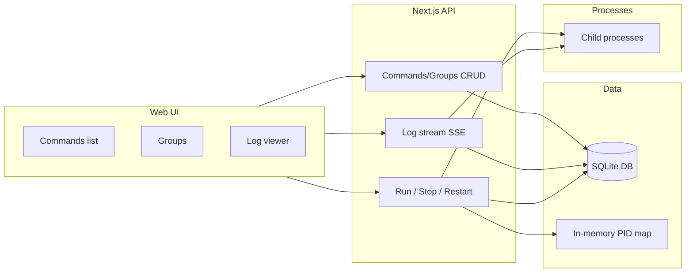

# Browser-based command launcher (XAMPP-style)

## Current state

- **Stack**: Next.js 16 (App Router), React 19, Tailwind 4, TypeScript ([package.json](package.json)).
- **App**: Default CNA template ([app/layout.tsx](app/layout.tsx), [app/page.tsx](app/page.tsx)); no launcher logic yet.

## Architecture

- **Runtime**: All process spawning and SQLite must run in **Node.js** (not Edge). Use default Node runtime for Route Handlers and ensure `child_process` and `better-sqlite3` are only used there.
- **Process tracking**: In-memory map `pid -> { childProcess, commandId, runId }` for stop/restart. On server restart the map is empty; “stop” can still be implemented by sending `process.kill(pid, 'SIGTERM')` using the PID stored in the DB for that run.
- **Log streaming**: Server-Sent Events (SSE) from Route Handlers: one stream per run. Stream stdout/stderr to the SSE response and append the same chunks to SQLite so logs are both live and persisted.
- **Group runs**: Commands in a group start **in parallel**. When any process exits with non-zero (or exits with error), the server kills all other processes in that group and marks the group run as failed.

## Data model (SQLite)

- **commands**  
`id`, `name`, `command` (text), `cwd`, `env` (JSON object or text), `created_at`, `updated_at`.  
Optional: `last_run_at`, `last_exit_code` (denormalized for “last run” and status).
- **runs**  
`id`, `command_id`, `pid` (nullable until spawned), `started_at`, `finished_at`, `exit_code` (nullable), `status` (`running` | `success` | `failed` | `killed`).  
One row per execution; “last run” = latest run for that `command_id`.
- **log_chunks**  
`id`, `run_id`, `stream_type` (`stdout` | `stderr`), `content` (text), `created_at`.  
Append-only; stream and persist each chunk.
- **groups**  
`id`, `name`, `created_at`.
- **group_commands**  
`group_id`, `command_id`, `sort_order`.  
Defines membership and order (for display; execution is parallel).
- **group_runs** (optional but recommended)  
`id`, `group_id`, `started_at`, `finished_at`, `status`.  
Links a “group run” so you can list runs and show “all failed” when one fails.

Migrations: single SQL file or a small migration runner; create tables if not exist on app startup (e.g. in a DB init module used by API routes).

## API design (App Router Route Handlers)

- **Commands**  
  - `GET /api/commands` – list commands (with last run info from `runs`).  
  - `POST /api/commands` – create (body: `name`, `command`, `cwd`, `env`).  
  - `GET /api/commands/[id]` – one command + last run.  
  - `PATCH /api/commands/[id]` – update (name, command, cwd, env).  
  - `DELETE /api/commands/[id]` – delete (and optionally cascade or restrict runs/logs).
- **Runs (execution)**  
  - `POST /api/commands/[id]/run` – start command; create `runs` row; spawn process with `cwd` and `env`; register in PID map; return `run_id`, `pid`.  
  - `POST /api/commands/[id]/stop` – body or query `runId` or identify by `command_id` + running; kill via PID map or `process.kill(pid)`; set `runs.finished_at` and `exit_code` / `status`.  
  - `POST /api/commands/[id]/restart` – stop current run (if any) then start again (same as run).
- **Groups**  
  - `GET /api/groups` – list groups with member command ids (and optionally last group run).  
  - `POST /api/groups` – create (body: `name`).  
  - `PATCH /api/groups/[id]` – update name; `PUT /api/groups/[id]/commands` – set members (body: `commandIds[]`).  
  - `DELETE /api/groups/[id]` – delete group.  
  - `POST /api/groups/[id]/run` – start all member commands in parallel; create `group_runs` row and one `runs` row per command; if any exits with non-zero, kill all others and set group run + runs to failed/killed.
- **Logs**  
  - `GET /api/runs/[runId]/logs` – fetch persisted log chunks (paginated or full) for history.  
  - `GET /api/runs/[runId]/logs/stream` – SSE stream for that run: while process is running, pipe stdout/stderr to SSE and append to `log_chunks`; after exit, optionally keep stream open and send a final “run finished” event.

All route handlers that use DB or `child_process`: under `app/api/`, no Edge; use shared DB connection helper and a single process manager module (spawn, PID map, “on exit” to update DB and optionally notify).

## Process manager (server-side module)

- **Spawn**: `spawn(command, args, { cwd, env: { ...process.env, ...commandEnv } })`. Parse `command` (e.g. split on spaces for simple case or use a shell option for complex commands—decide one convention and document it).
- **PID map**: Store `run_id`, `command_id`, `ChildProcess`; on exit, update `runs` (finished_at, exit_code, status) and remove from map.
- **Group run**: For each command in group, call spawn and record run_id; on any “exit” with non-zero, iterate map for that group run and kill remaining processes; update all runs and group_run status.
- **Logging**: On each stdout/stderr `data` event, (1) append row to `log_chunks`, (2) if there’s an active SSE writer for that run_id, write the chunk to the stream. Use a simple in-memory map `runId -> writer[]` so multiple clients can subscribe to the same run.

## Frontend (React)

- **Layout**: Sidebar or tabs for “Commands”, “Groups”, and maybe “Running” (or show running in Commands/Groups).
- **Commands**
  - List: name, command (truncated), cwd, last run time, status (running / last exit code), actions: Run, Stop, Restart, Edit, Delete, View logs.
  - “Add command” form: name, command, cwd, env (key/value list or text area).
- **Groups**
  - List groups; create group (name); edit group: add/remove saved commands (multiselect from saved commands), reorder if desired.
  - Run group button; show “running” state and “one failed → all stopped” behavior.
- **Running indicator**: Show which commands are running (by PID) — use polling (e.g. `GET /api/commands` or `GET /api/runs?status=running`) or a single SSE that broadcasts “run started/stopped” (optional).
- **Logs**
  - For a chosen run: open SSE to `GET /api/runs/[runId]/logs/stream` and append to a log viewer (e.g. `<pre>` or terminal-style); no full-page refresh. When run is finished, allow viewing same logs from DB via `GET /api/runs/[runId]/logs` (e.g. “Load full history” or default to stream then fallback to fetch for past runs).

## Dependencies

- **better-sqlite3** and **@types/better-sqlite3** – SQLite in API routes.
- No extra dependencies strictly required for SSE (use `TransformStream` and Response with `text/event-stream`). Optional: **zod** for request body validation.

## Security and safety (local-only)

- Document that the app is for **local use only** (e.g. `localhost`). No auth in scope unless you add it later.
- Validate `cwd` to prevent escaping (e.g. resolve to real path and ensure it’s under a allowed base or current working directory).
- Sanitize or restrict `command` if needed (e.g. no arbitrary code execution beyond what the user intends); env vars from DB applied as-is.

## File structure (suggested)

- `lib/db.ts` – SQLite connection, init schema, migrations.
- `lib/process-manager.ts` – spawn, PID map, group run, log piping to DB and SSE.
- `app/api/commands/route.ts`, `app/api/commands/[id]/route.ts`, `app/api/commands/[id]/run/route.ts`, `app/api/commands/[id]/stop/route.ts`, `app/api/commands/[id]/restart/route.ts`.
- `app/api/groups/route.ts`, `app/api/groups/[id]/route.ts`, `app/api/groups/[id]/run/route.ts`, `app/api/groups/[id]/commands/route.ts`.
- `app/api/runs/[runId]/logs/route.ts`, `app/api/runs/[runId]/logs/stream/route.ts`.
- `app/page.tsx` – dashboard (commands + groups + running).
- `app/commands/page.tsx` (or sections in dashboard) – command list and form.
- `app/groups/page.tsx` – group list and edit.
- Components: CommandForm, CommandList, GroupForm, GroupList, LogViewer (SSE + fetch), RunControls (Run/Stop/Restart).

## Implementation order

1. **DB and schema** – Add better-sqlite3, create `lib/db.ts` and tables (commands, runs, log_chunks, groups, group_commands, group_runs).
2. **Commands CRUD API** – Implement commands and runs (create run row on start; update on exit).
3. **Process manager** – Spawn, PID map, stdout/stderr → DB; wire run/stop/restart to API.
4. **Log streaming** – SSE endpoint that reads from process and DB; persist chunks in process manager.
5. **Groups API and group run** – Parallel start, on-first-failure kill all, update runs and group_runs.
6. **Frontend** – Commands list/form, run/stop/restart, “last run” and “running by PID”, log viewer (stream + persisted).
7. **Frontend groups** – Group list, create/edit, run group, show group run status.
8. **Env vars** – Already in schema; ensure form and API pass `env` through to spawn options.
9. **Polish** – Validation (zod), error messages, basic UX (loading states, confirm stop/restart).

## Open decisions (to confirm in impl)

- **Command parsing**: Run via `child_process.spawn` with first token as executable and rest as args, or run in a shell (`sh -c '...'`) so user can use pipes/redirects. Shell is more flexible but slightly less safe; recommend shell for “launcher” use case and document it.
- **Log chunk size**: Append per `data` event vs buffering (e.g. 4KB) to reduce DB writes; start with per-event for simplicity.
- **DB file location**: e.g. `./data/launcher.db` or under project root; create `data/` if missing.

